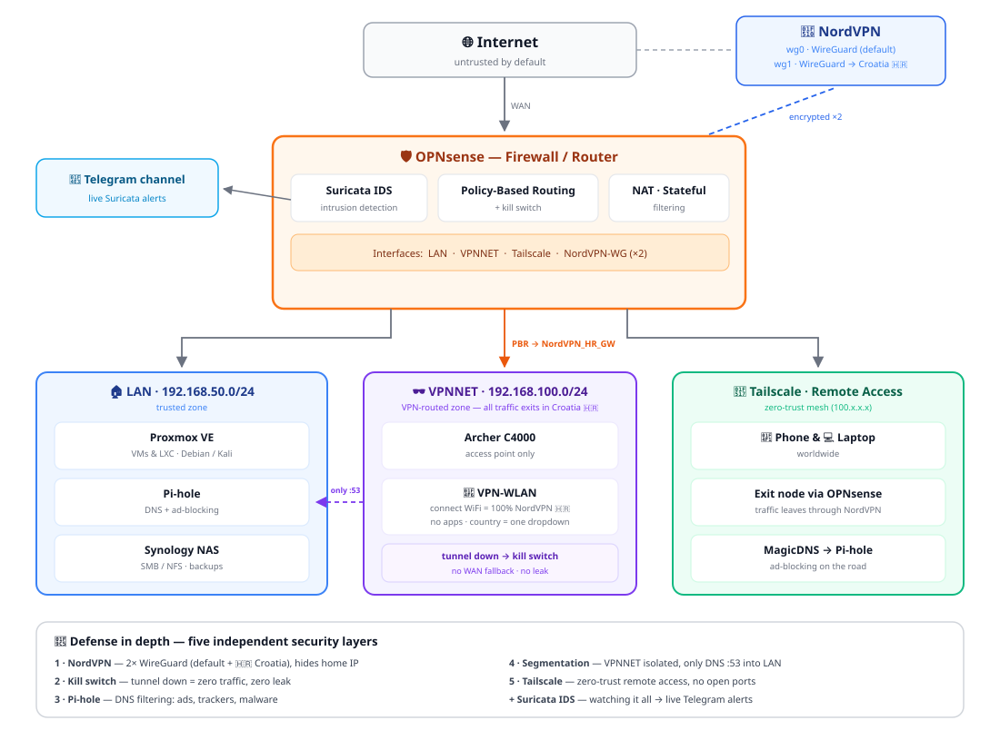

# 🛡️ Andro Lab — Cybersecurity Homelab

> A multi-layer defense-in-depth cybersecurity lab built from scratch.
> From CNC machinist to cybersecurity — this is my journey, documented in code and configs.

---

## 📖 About

I'm **Andrija Tadic**, a former CNC machine operator currently transitioning into IT through a Swiss SIZ ICT Supporter program (Power-User track). My long-term goal: **cybersecurity engineer**, helping people stay safe online.

This repository documents my self-built homelab — every architectural decision, every misconfiguration, every lesson learned. It's both my learning journal and my showcase.

**Why this matters:** I didn't follow a tutorial. I designed, built, broke, debugged, and rebuilt this lab — three times for OPNsense alone. That iterative process taught me more about networking and security than any textbook could.

---

## 🏗️ Architecture

> 📊 **Full architecture details:** [`docs/architecture.md`](./docs/architecture.md)

---

## 🛡️ Security Layers

This lab implements **defense in depth** — five independent security layers:

| Layer | Component | Purpose |
|-------|-----------|---------|
| 1 | **NordVPN-WireGuard** | Hide home IP, encrypt all traffic |
| 2 | **OPNsense Firewall** | Stateful filtering, network segmentation, killswitch |
| 3 | **PiHole DNS** | Block ads, trackers, and malware domains |
| 4 | **Tailscale Mesh** | Zero-trust remote access, end-to-end encrypted |
| 5 | **HTTPS / Caddy + Crowdsec** | Application-layer encryption + brute-force protection |

If any single layer fails, the others continue protecting the system.

---

## 🧰 Tech Stack

**Infrastructure**
- Proxmox VE (hypervisor)
- Debian 12/13 (VM base)
- Docker (containerized services)

**Networking**
- OPNsense (firewall + router)
- WireGuard (VPN protocol)
- NordVPN (commercial VPN provider)
- Tailscale (mesh VPN with WireGuard)
- PiHole (DNS sinkhole)
- Kea DHCP (modern DHCP server)

**Services**
- Vaultwarden (Bitwarden-compatible password manager)
- Caddy (reverse proxy with automatic HTTPS)
- Crowdsec (collaborative IPS)
- Suricata (IDS/IPS mit Telegram Alerting)

**Tools used during build**
- `tcpdump`, `pfctl`, `route`, `ss` — diagnostics
- `curl`, `jq` — API interactions
- `ssh`, `nano`, `vim` — administration

---

## 🎯 Key Features

### 🛡️ Privacy by Design
- All LAN traffic flows through NordVPN
- Killswitch prevents IP leaks if VPN drops
- DNS traffic filtered through PiHole
- No data leaves the network unencrypted

### 🌍 Secure Remote Access
- Tailscale mesh: phone/laptop reach lab from anywhere
- Subnet routing: full LAN access via single endpoint
- Exit Node: mobile devices route through home NordVPN
- HTTPS certificates from Let's Encrypt via Tailscale

### 🔒 Hardened Authentication
- Master passwords: Diceware passphrases (80+ bits entropy)
- 2FA enforced via TOTP
- Recovery codes printed and stored offline
- Argon2-hashed admin tokens

### 📦 Production-Grade Operations
- Snapshot-based recovery (Proxmox)
- Volume-based data persistence (Docker)
- Automatic restart policies
- Separation of concerns (one service per VM)

---

## 📚 Documentation

Each component has detailed setup notes including the mistakes I made:

- 📘 [**Architecture Deep-Dive**](./docs/architecture.md) — How everything connects
- 🔥 [**OPNsense + NordVPN + Killswitch**](./docs/opnsense.md) — The foundation
- 🛡️ [**PiHole DNS Filtering**](./docs/pihole.md) — Blocking ads at the network level
- 🌐 [**Tailscale Setup**](./docs/tailscale.md) — Mesh VPN, Subnet Routes, Exit Node
- 🔒 [**Vaultwarden with HTTPS**](./docs/vaultwarden.md) — Self-hosted password manager
- 💡 [**Lessons Learned**](./docs/lessons-learned.md) — What broke, what I learned

---

## 🚧 Lessons Learned (Highlights)

> *"Theory is when you know everything but nothing works. Practice is when everything works but nobody knows why. Here, theory and practice are combined: nothing works and nobody knows why."*

A few hard-won insights from this project:

- **OPNsense + NordVPN routing** required careful firewall rule ordering — I broke this 3 times before getting it right
- **Tailscale Exit Node + NordVPN** had a hidden issue: Tailscale's internal SNAT bypassed our NAT rules. Disabling SNAT was the fix
- **Critical infrastructure must be independent**: Proxmox host should not depend on PiHole VM for DNS — circular dependency at boot
- **`apt autoremove` and kernels**: Always check `uname -r` before removing — never delete the running kernel
- **TLS errors aren't always errors**: `WARN: Caddyfile not formatted` looks scary but is purely cosmetic

For full details: [`docs/lessons-learned.md`](./docs/lessons-learned.md)

---

## 📈 Skills Demonstrated

Building this lab developed real-world expertise in:

- **Network design**: VLANs, subnet segmentation, routing
- **Firewall configuration**: Stateful inspection, NAT, killswitch logic
- **VPN protocols**: WireGuard internals, mesh vs. site-to-site
- **DNS architecture**: Recursive resolvers, conditional forwarding, sinkholes
- **Linux administration**: systemd, networking, package management
- **Container orchestration**: Docker, volumes, environment variables
- **Reverse proxies**: Caddy with automatic TLS
- **Diagnostics**: `tcpdump`, `pfctl`, log analysis
- **Security operations**: Defense in depth, hardening, secret management
- **Documentation**: Clear, technical writing

---

## 🛣️ Roadmap

Planned next steps:

- [ ] Centralized logging (Grafana Loki / Graylog)
- [ ] Monitoring (Prometheus + Grafana)
- [x] IDS/IPS in OPNsense (Suricata or Zenarmor)
- [ ] Automated backup pipeline (Restic to remote storage)
- [ ] CI/CD pipeline for config changes
- [ ] Certificate management (cert-manager-style)
- [ ] Secrets management (Vault or similar)

---

## 🔗 Related Projects

- [active-directory-lab](https://github.com/sudoAndro/active-directory-lab) — Windows Server 2022, AD DS, GPOs, DNS Filtering
- [windows-starter-kit](https://github.com/sudoAndro/windows-starter-kit) — Automated PowerShell 7 Setup

---

## 🤝 Connect

I'm always open to discussions about cybersecurity, networking, and homelabs.

- 🌐 Website: [andrijantadic.ch](https://andrijantadic.ch)
- 📧 Email: *via my website*

If you're a hiring manager or recruiter in cybersecurity — let's talk.

---

## ⚠️ Disclaimer

All configurations in this repository are **anonymized templates**. Real IPs, hostnames, tokens, and keys have been replaced with placeholders. This is intentional: the goal is to share architecture and approach, not to expose my live infrastructure.

> **Never copy configs blindly into production.** Read, understand, adapt.

---

## 📜 License

[MIT](./LICENSE) — feel free to learn from this, fork it, build your own.

---

*Built with curiosity, debugged with patience, documented for the next person.*

🐢 — *slowly but surely*
