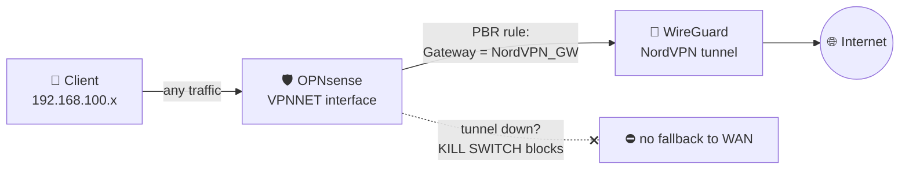
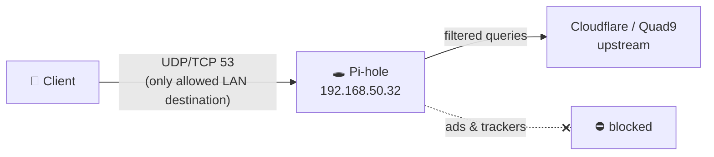

# VPN-Routed Network Segment (VPNNET)

Repurposing a dead "IoT quarantine" network into a fully VPN-routed segment on
OPNsense — every device in this network (wired or WiFi) is forced through a
NordVPN WireGuard tunnel, protected by a kill switch, with ad-blocking and
leak-free DNS via Pi-hole.

**The everyday win:** joining the dedicated WiFi = instant full-tunnel VPN.
No VPN app on the device, no switching between Tailscale and NordVPN clients.
Change the WiFi, change your privacy level.

---

## Before / After

| | Before | After |
|---|---|---|
| Network | `Isoliert` (IoT quarantine), used once, then abandoned | `VPNNET` — active VPN segment |
| Routing | Default WAN | Policy-Based Routing → NordVPN (WireGuard) |
| Tunnel failure | Traffic would leak via WAN | Kill switch blocks everything |
| DNS | Unbound on firewall → recursive via WAN (**leaked real IP**, no ad-blocking) | Pi-hole → upstream resolvers (no leak, ads filtered) |
| Old Archer C4000 router | Collecting dust | Access point for the VPN-WLAN |

---

## Architecture

### Traffic flow

### DNS chain

Clients get the Pi-hole as their DNS server via DHCP (Kea). The firewall allows
**only** port 53 to that single host — the rest of the private LAN stays
unreachable from VPNNET (least privilege).

---

## Firewall rules (VPNNET interface, in order)

Rule order matters — first match wins.

| # | Action | Proto | Source | Destination | Port | Gateway | Purpose |
|---|--------|-------|--------|-------------|------|---------|---------|
| 1 | Pass | TCP/UDP | VPNNET net | Pi-hole host | 53 | default | DNS to Pi-hole (only LAN exception) |
| 2 | Block | any | VPNNET net | LAN net | any | — | Isolate from private LAN |
| 3 | Block | any | VPNNET net | This Firewall | any | — | Protect OPNsense GUI/SSH |
| 4 | Pass | any | VPNNET net | any | any | **NordVPN_GW** | Route all remaining traffic into the tunnel |
| 5 | Block | any | VPNNET net | any | any | — | **Kill switch** |

### Kill switch logic

Rule 4 only matches while the NordVPN gateway is up. If the tunnel goes down,
the gateway becomes invalid, rule 4 stops matching, and rule 5 drops
everything. Result: no silent fallback to the regular WAN, no IP leak —
the segment simply has no internet until the tunnel returns.

---

## Outbound NAT

Firewall → NAT → Outbound, **Hybrid mode** (manual rules take precedence):

| Interface | Source | Translation |
|-----------|--------|-------------|
| NordVPN (WireGuard) | 192.168.100.0/24 | Interface address |

Without this rule, packets enter the tunnel with their private
`192.168.100.x` source address — NordVPN doesn't know that network, so replies
never come back. The NAT masks the segment behind the tunnel IP, same logic as
regular WAN NAT, just on the WireGuard interface.

---

## DHCP (Kea)

Subnet `192.168.100.0/24`, pool `.10 – .50`. **"Auto collect option data"
disabled**, options set manually:

| Option | Value |
|--------|-------|
| Router | 192.168.100.1 (VPNNET interface) |
| DNS server | 192.168.50.32 (Pi-hole) |

⚠️ Disabling auto-collect clears *all* options — forgetting to re-add the
router option leaves clients with no gateway ("connected, no internet").

---

## Validation

1. `curl ifconfig.me` from a VPNNET client → must return a **NordVPN IP**
2. DNS leak test → must show upstream resolvers (Cloudflare/Quad9), **never the ISP**
3. Ad-heavy website → Pi-hole filtering active
4. Kill switch drill: disable the WireGuard instance → client must lose
   internet entirely (no WAN fallback), re-enable → traffic resumes through tunnel

---

## Lessons learned

- **"Save" is not "Apply".** Rules were configured correctly but never
  activated — OPNsense stages changes until you hit *Apply*. Cost: 20 minutes
  of debugging a config that was already right. Now part of my checklist.
- **DNS follows its own path.** Traffic in the tunnel ≠ DNS in the tunnel.
  With Unbound answering VPNNET directly, the firewall resolved queries
  recursively over the regular WAN — the leak test showed my real IP while all
  actual traffic was safely tunneled. Fixed by pointing DHCP at Pi-hole and
  allowing only that one host on port 53.
- **Isolation ≠ anonymization.** The old "quarantine" concept (lock devices
  away) and the new VPN concept (hide traffic) are different security goals.
  Renaming the interface (`Isoliert` → `VPNNET`) keeps the documentation
  honest for future me.
- **Layer-by-layer debugging** beats guessing: link → gateway → raw IP
  (`ping 1.1.1.1`) → DNS (`ping google.com`). Each step isolates one failure
  domain.
